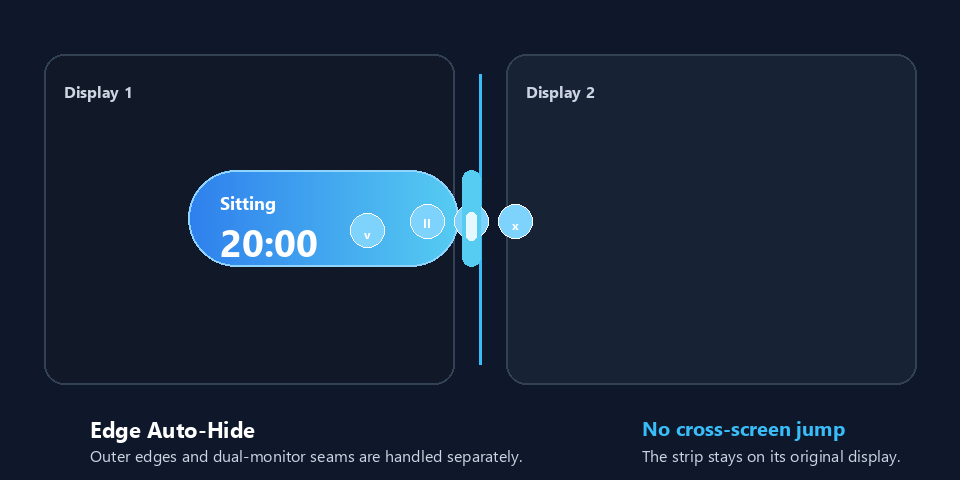
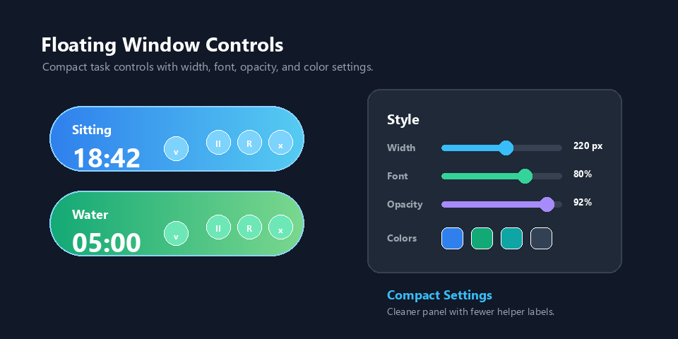
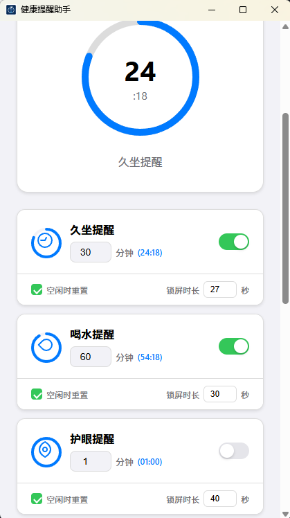
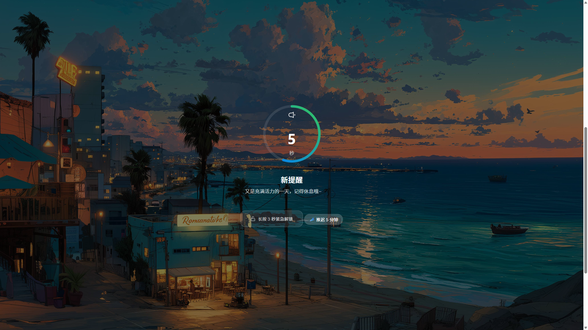

<h1 align="center">健康办公助手 (Health Reminder)</h1>

<p align="center">
  <a href="https://tauri.app/"></a>
  <a href="LICENSE"></a>
  <a href="https://github.com/kaima2022/Health-reminder/releases"></a>
</p>

<p align="center">
  极简、精准、高效 — 为现代办公族量身定制的健康守护应用
</p>


<p align="center">
  <strong>中文</strong> | <a href="./README.en.md">English</a>
</p>

---

## 简介

在快节奏的数字时代，健康的身体是高效生产力的基石。**健康办公助手(Health Reminder)** 是一款基于 Rust 与 Tauri 开发的高性能桌面应用，旨在通过智能化的任务排程与多维提醒，帮助你在专注工作的同时，科学地进行久坐、补水与用眼休息。


##  展示

### 悬浮窗靠边隐藏与样式优化

<p align="center">
  
  
</p>

### 悬浮窗与定点提醒

<p align="center">
  
  
</p>

<p align="center">
  
  
</p>

### 主界面 (Dashboard) & 自定义任务排程 (Tasks)

<p align="center">
  

  

  
</p>

### 预告与弹窗 (Notifications)

<p align="center">
  

  
</p>

### 托盘显示

<p align="center">
  
  &nbsp;&nbsp;&nbsp;&nbsp;&nbsp;&nbsp;&nbsp;&nbsp;&nbsp;&nbsp;
  
</p>


### 多显示屏锁屏功能（支持严格模式）


### 空闲监测功能-空闲时自动暂停并且重置
<p align="center">
  
</p>

### 自定义锁屏图片




### 设置界面（简洁&高级设置）


<p align="center">
  
	&nbsp;&nbsp;&nbsp;&nbsp;&nbsp;&nbsp;&nbsp;&nbsp;&nbsp;&nbsp;
  

</p>


---

## 为什么你需要它？

### 1. 真的能让你休息
- **全屏休息提醒**：任务到点后，即使主窗口已最小化到托盘，也会弹出覆盖桌面的休息界面，真正把注意力从工作中拉回来。
- **多显示器覆盖**：扩展屏和复制屏场景都会同步显示休息界面，并持续保持置顶，避免转到副屏继续工作。
- **强制休息模式**：普通模式保留“长按 3 秒紧急解锁”，开启强制休息后会隐藏该入口，其他提醒和推迟行为保持不变。
- **灵活结束休息**：可以在倒计时结束后手动确认，也可以开启自动解锁，按自己的习惯返回工作。
- **锁屏输入防护**：休息倒计时期间会拦截键盘、鼠标滚轮和无关点击，减少误操作背景窗口。
- **个性化休息界面**：每项任务可独立设置锁屏时长，还可以选择本地图片作为主屏与副屏的锁屏背景。
- **可靠的时间冻结**：应用锁屏、系统锁屏、全局暂停、单任务暂停和空闲期间都会冻结相应倒计时，恢复后不会莫名增加或跳秒。

### 2. 贴心不打扰
- **提前预告**：每项任务都能独立设置预告秒数，在全屏提醒前先通知你保存工作。
- **可控推迟**：每项任务可设置推迟分钟数，并通过最大推迟次数限制反复拖延；推迟期间会显示准确的剩余时间。
- **临近任务合并**：可按自定义阈值把即将到点的多个任务合并成一次休息，避免刚坐下又被连续提醒。
- **智能空闲检测**：离开电脑超过设定阈值后，可自动重置并暂停选定任务，回来时不会立刻触发不合时宜的提醒。
- **媒体处理策略**：Windows 上可选择不处理媒体、仅暂停系统明确识别到的视频，或暂停全部活动媒体，默认不会打断音乐。
- **多重通知兜底**：支持系统通知、应用内提示和提醒声音；通知权限不足或发送失败时会自动回退，不会悄悄漏掉提醒。
- **自定义提示音**：可以选择、测试和清除本地音频；自定义音频播放失败时仍会回退到默认提示音。
- **静默自启动**：可随系统登录自动启动并直接隐藏到托盘，不在开机时弹出主窗口打断操作。

### 3. 简单好用
- **完整的任务系统**：内置久坐、喝水和护眼提醒，也可以添加任意自定义任务，多项提醒彼此独立并行。
- **间隔与定点调度**：任务既能每隔若干分钟触发，也能设置每天多个 `HH:mm` 时间点，例如 11:00 运动、21:00 泡脚。
- **任务级精细控制**：每项任务都能独立启停、暂停、恢复和重置，并配置间隔、预告、推迟、锁屏时长与空闲重置策略。
- **快捷批量操作**：主界面和托盘均支持全局暂停、继续、全部重置；托盘还可以直接重置指定任务。
- **后台精准计时**：计时器运行在 Rust 后端，不依赖界面刷新，即使窗口最小化或长期驻留托盘也能准时提醒。
- **两种悬浮窗模式**：置顶悬浮窗可以显示下一个健康提醒，也可以显示带标题和目标时间的自定义倒计时。
- **悬浮窗任务控制**：通过任务菜单切换当前倒计时，并可直接暂停、恢复或重置当前任务，不影响其他任务。
- **可定制悬浮窗**：支持拖动、宽度、字体大小、透明度、背景色和文字色设置，并提供蓝色、绿色、青绿、深蓝与透明主题。
- **靠边自动隐藏**：悬浮窗贴边后可自动收起，鼠标靠近时展开，并针对双显示器中间接缝减少误隐藏和跨屏跳动。
- **实用托盘菜单**：可显示主窗口、切换悬浮窗、暂停或继续、重置任务和退出；托盘提示会展示任务剩余时间。
- **主题与语言**：支持亮色/暗色主题和中英文界面，托盘菜单与多屏锁屏文案会同步切换。
- **便捷更新与跨平台安装**：支持自动检查、手动检查和应用内更新，提供 Windows、macOS、Linux 安装包以及 Windows Scoop 安装与更新。

---

## 技术架构

本产品追求极致的内存占用与启动速度：

- **Backend**: [Rust](https://www.rust-lang.org/) (Tauri 2.0) - 提供安全、高性能的系统底层能力。
- **Frontend**: [Vite](https://vitejs.dev/) + Vanilla TypeScript - 极简的渲染逻辑，确保 UI 响应零延迟。
- **Communication**: Tauri IPC - 高速的前后端异步通信协议。
- **Styles**: CSS Variables (Modern Design System) - 丝滑的 Apple 风格 UI。

---

## 下载与安装

### 方式1.安装包

您可以直接前往 [GitHub Releases](https://github.com/kaima2022/Health-reminder/releases) 页面下载适用于您系统的最新版安装包。支持 Windows (.exe), macOS (.dmg), 以及 Linux (.deb, .AppImage)。

### 方式2. Windows Scoop 安装或更新

```powershell
# 添加 bucket（首次安装）
scoop bucket add health-reminder https://github.com/kaima2022/Health-reminder

# 安装
scoop install health-reminder

# 更新
scoop update health-reminder
```


---

## 从代码构建

如果您希望从源码编译并运行本项目，请确保您的系统中已安装 Rust 工具链与 Node.js 环境。

### 1. 开发环境运行
```bash
# 安装依赖
npm install

# 启动开发服务器与应用
npm run tauri dev
```

### 2. 生成安装包
```bash
# 构建适用于当前系统的正式版本
npm run tauri build
```

---

## 后续路线图

- [ ] 数据统计视图：查看周/月健康达成率。
- [x] 更多系统音效：支持自定义上传提醒音。
- [ ] 专注模式联动：在电脑全屏工作或游戏时智能静默。

## 版本记录

> ### 多种更新方式：自动检查更新 || 手动检查更新 || 安装包更新 || Scoop 更新 
> 
> 

> #### scoop 更新命令
> scoop update health-reminder

### v1.9.0 (2026-08-28)
- **锁屏提醒行为修复**（[#27](https://github.com/kaima2022/Health-reminder/issues/27)）：无论是否开启强制休息模式，提醒到点后都会显示完整锁屏界面；强制休息模式现在只负责隐藏长按紧急解锁按钮，不再改变提醒方式。
- **锁屏媒体策略**（[#27](https://github.com/kaima2022/Health-reminder/issues/27)）：新增“不暂停媒体”“仅暂停识别到的视频”和“暂停全部媒体”三档设置。默认不干预媒体；仅视频模式只暂停 Windows 明确报告为视频的会话，音乐和未知类型保持播放。

### v1.8.7 (2026-08-27)
- **Linux 锁屏稳定性修复**（[#26](https://github.com/kaima2022/Health-reminder/issues/26)）：锁屏看门狗对窗口和显示器的访问统一切换到 Tauri 主线程，避免 Linux GTK/GDK 在后台线程调用时出现内存损坏和崩溃。
- **锁屏窗口恢复更稳健**：显示器重新扫描期间先释放锁屏状态锁，再按当前锁屏代次回写窗口列表，减少显示器变化时的竞争与卡死风险。

### v1.8.6 (2026-08-20)
- **锁屏媒体暂停修复**（[#25](https://github.com/kaima2022/Health-reminder/issues/25)）：Windows 锁屏开始前会先暂停正在播放的浏览器媒体会话，并仅对确认正在出声的本地播放器窗口发送暂停命令，避免已暂停的播放器被误触发为播放状态。
- **锁屏启动鲁棒性**：媒体暂停最多等待短时间，不会因为系统媒体 API 或播放器响应变慢而拖住锁屏启动。

### v1.8.5 (2026-08-13)
- **紧急解锁稳定性修复**（[#24](https://github.com/kaima2022/Health-reminder/issues/24)）：长按 3 秒紧急解锁改为 Pointer 捕获与固定 deadline 计时，减少锁屏窗口抢焦点或事件丢失时长按无效的问题。
- **复制屏锁屏显示修复**（[#24](https://github.com/kaima2022/Health-reminder/issues/24)）：多显示器锁屏按显示器几何去重，双屏复制/镜像场景不会再为同一桌面坐标额外补出副屏锁屏窗口，减少倒计时错乱和无法退出。

### v1.8.4 (2026-08-13)
- **锁屏退出可靠性修复**（[#21](https://github.com/kaima2022/Health-reminder/issues/21)）：收紧锁屏结束时的任务重置与后端锁屏态释放顺序，避免倒计时归零边界下锁屏界面和主界面反复切换。
- **媒体播放联动**（[#22](https://github.com/kaima2022/Health-reminder/issues/22)）：Windows 上进入锁屏前会尝试暂停正在播放的媒体会话，减少休息时视频或音乐继续播放。
- **鲁棒性维护**：通知确认增加防重入保护，批量重置任务后统一刷新倒计时；Rust 后端通过 clippy 严格检查并清理静态告警。

### v1.8.3 (2026-08-12)
- **安全维护**（[CVE-2026-31812](https://github.com/advisories/GHSA-6xvm-j4wr-6v98)）：将 `quinn-proto` 从 `0.11.13` 更新到 `0.11.14`，修复 QUIC transport parameter 解析异常可能导致的远程拒绝服务风险。
- **发布处理**：未合并外部自动扫描 PR [#20](https://github.com/kaima2022/Health-reminder/pull/20)，由维护者在主分支重新应用同等修复并完成验证。

### v1.8.2 (2026-08-11)
- **锁屏触发可靠性修复**（[#19](https://github.com/kaima2022/Health-reminder/issues/19)）：修复极短锁屏时长和倒计时归零边界下可能漏弹锁屏的问题，前端会主动确认后端待触发任务并在处理完成后回执。
- **锁屏输入防护**（[#19](https://github.com/kaima2022/Health-reminder/issues/19)）：锁屏倒计时期间拦截键盘、滚轮和非锁屏控件点击，减少误操作背景窗口。

### v1.8.1 (2026-07-03)
- **悬浮窗外观热修**：移除悬浮窗外侧阴影，并弱化右下角拖拽提示，透明/浅色主题下更干净。
- **靠边隐藏触发收紧**：将靠边吸附检测范围从宽松距离收窄到贴边触发，避免离边较远时提前隐藏。

### v1.8.0 (2026-07-03)
- **悬浮窗靠边隐藏优化**（[#18](https://github.com/kaima2022/Health-reminder/issues/18)）：新增靠边自动隐藏与鼠标靠近自动展开，区分外侧屏幕边缘和双屏中间接缝，避免跨屏横跳或展开到另一块屏。
- **悬浮窗交互稳定性**（[#18](https://github.com/kaima2022/Health-reminder/issues/18)）：折叠态禁用拖拽/缩放误触，隐藏条被移动时会自动回到原边缘，减少小概率无法拉出的情况。
- **悬浮窗外观设置**：支持更窄宽度、字体大小、透明度、背景色和文字色配置，设置区去除多余说明文字，保持界面更紧凑。

### v1.7.5 (2026-06-13)
- **v1.7 稳定性维护**：统一全局暂停、单任务暂停、系统锁屏、应用锁屏和空闲状态的冻结逻辑，悬浮窗暂停后剩余时间保持稳定，不再异常增加。
- **更新与发布体验修复**（[#13](https://github.com/kaima2022/Health-reminder/issues/13)、[#14](https://github.com/kaima2022/Health-reminder/issues/14)）：修复推迟计时少一分钟、暗夜模式下拉栏、语言切换后提醒文案、通知兜底、悬浮窗主窗口按钮、版本显示、Release 构建并发和检查更新错误提示不可见等问题。

### v1.7.0 (2026-06-07)
- **悬浮窗倒计时**（[#12](https://github.com/kaima2022/Health-reminder/issues/12)、[#16](https://github.com/kaima2022/Health-reminder/issues/16)）：新增置顶椭圆形悬浮窗，可显示下一个健康提醒或自定义目标倒计时，并支持蓝色、绿色、青色、深色主题。
- **悬浮窗任务控制**（[#16](https://github.com/kaima2022/Health-reminder/issues/16)）：下拉图标可展开任务列表，支持切换当前显示任务；暂停/恢复只作用于当前任务，默认模式会提示最近可触发任务。
- **定点提醒**（[#15](https://github.com/kaima2022/Health-reminder/issues/15)）：自定义任务支持 `interval` 与 `daily` 两种调度，daily 可配置多个 `HH:mm` 时间点。

### v1.6.2 (维护版)
- **自定义提示音**（[PR #10](https://github.com/kaima2022/Health-reminder/pull/10)）：支持选择本地音频作为提醒音，并保留默认系统提示音兜底。
- **静默自启**（[#9](https://github.com/kaima2022/Health-reminder/issues/9)）：开机自启可直接隐藏到托盘，减少启动打扰。
- **通知诊断**（[#13](https://github.com/kaima2022/Health-reminder/issues/13)）：系统通知失败时不再静默失败，会回退到应用内提醒。
- **发布链路**（[#14](https://github.com/kaima2022/Health-reminder/issues/14)）：统一更新器、Scoop manifest 与文档链接到 `kaima2022/Health-reminder`。

### v1.6.1 (2026-02-04)
- **暗夜配色**：优化暗色主题配色与对比度，夜间使用更舒适。
- **Logo 去白边**：应用图标去除白边（含 iOS AppIcon），显示更干净。
- **空闲横幅显示时间**：空闲提示横幅新增空闲时长显示。

### v1.6.0 (2026-01-31)
- **自定义锁屏背景**：新增锁屏背景图片自定义功能，可在设置中选择本地图片作为锁屏背景。
- **多屏背景同步**：副屏锁屏现在也会显示自定义背景图片，与主屏保持一致。
- **Linux 多屏锁定增强**：优化 Linux 平台多屏锁定机制，看门狗检测频率提升至 200ms，增强 X11/Wayland 兼容性。
- **修复**：修复 Tauri v2 对话框插件返回值导致图片路径无法正确保存的问题。

### v1.5.9 (2026-01-27)
- **空闲重置通知横幅**：新增空闲检测横幅通知，当检测到用户空闲并重置任务时，显示美观的紫色通知横幅，点击"知道了"关闭。
- **UI 优化**：将"空闲检测阈值"设置移至"空闲时重置并暂停任务"开关下方，开关关闭时自动隐藏阈值设置，界面更简洁。
- **文案优化**：将"空闲时重置任务"更名为"空闲时重置并暂停任务"，更准确描述功能行为。

### v1.5.8 (2026-01-20)
- **计时器修复**：修复了推迟任务后，其他禁用任务的剩余时间异常增长的问题（涉及 timer_resume、timer_set_system_locked、timer_set_lock_screen_active 三处时间补偿逻辑）。
- **Scoop 安装修复**：修复了 Scoop bucket 文件中 URL 和 hash 位置错误导致无法安装的问题。
- **CI/CD 修复**：修复了 GitHub Action 中 bucket 更新脚本未正确更新 architecture.64bit.url 和 hash 的问题。

### v1.5.7 (2026-01-16)
- **合并任务功能 (Merge Tasks)**：新增“合并任务”功能，当多个任务临近触发时（可设置阈值），系统会智能地将其合并为一次休息，避免连续不断的打断，彻底解决“刚坐下又响了”的烦恼。
- **锁屏体验优化**：锁屏界面现可显示所有合并的任务名称，让您清楚知道当前休息包含哪些项目。
- **逻辑修复**：修复了在合并任务时，推迟操作和解锁操作未能正确清理所有相关任务的问题。

### v1.5.6 (2026-01-13)
- **Bug 修复**：修复了界面最小化时可能导致锁屏功能异常的问题。

### v1.5.5 (2026-01-13)
- **macOS 修复**：修复了点击 Dock 栏图标无法唤起主窗口的问题。

### v1.5.4 (2026-01-10)
- **国际化支持 (i18n)**：新增中英文语言切换功能，界面右上角可快速切换语言
- **多语言托盘菜单**：托盘右键菜单支持中英文实时切换
- **多屏锁屏语言同步**：修复副屏锁屏显示语言与主屏不一致的问题
- **英文 README**：新增 [README.en.md](./README.en.md) 英文文档

### v1.5.3 (2026-01-09)
- **锁屏保活与修复**：修复了 Windows 10 下强制锁屏窗口可能被最小化或丢失焦点的问题（Watchdog 机制）。
- **推迟功能 (Snooze)**：新增“推迟”功能，支持自定义每次推迟的时长（默认 5 分钟），并正确显示推迟倒计时。
- **新增自动退出锁屏**：新增“倒计时结束自动解锁”选项，无需手动点击确认即可退出锁屏。
- **严格模式**：**新增严格模式，严格模式下，必须好好休息，禁止退出，要好好爱护身体奥！**
- **严格模式增强**：新增“严格模式允许推迟”选项；严格模式下默认隐藏推迟按钮，且支持设置最大推迟次数。
- **提醒预告**：新增任务触发前的预告通知（默认提前 5 秒），支持每任务独立配置。
- **UI/UX 升级**：
    - **高级设置折叠**：将不常用的系统设置收纳至“高级设置”折叠面板，界面更清爽。
    - **卡片设置优化**：重构任务卡片底部设置栏，采用 Grid 布局且默认收起，支持一键展开配置。
    - **右键菜单增强**：托盘右键菜单新增“重置单个任务”子菜单。
- **性能优化**：降低了长期运行的内存占用。

### v1.5.2 (2026-01-04)
- **跨平台空闲检测**：新增系统空闲检测功能，支持 Windows、macOS、Linux 三平台。
- **空闲自动重置**：用户无操作超过设定阈值时，自动重置已勾选的任务倒计时。
- **空闲阈值可配置**：支持在设置中自定义空闲检测阈值（1-60 分钟）。
- **任务级别控制**：每个任务可独立设置是否启用空闲时重置功能。
- **UI 优化**：统一任务卡片底部区域样式，提升视觉一致性。

### v1.5.1 (2025-12-27)
- **后端定时器重构**：将计时逻辑从前端 JavaScript 移至 Rust 后端，解决 macOS App Nap 和窗口最小化时计时器被节流导致倒计时变慢的问题。
- **跨平台计时精准**：采用系统级线程定时器，不受 WebView 节流影响，Windows/macOS/Linux 表现一致。
- **准时提醒保障**：即使应用在后台或最小化状态，也能准时触发提醒通知。

### v1.5.0 (2025-12-26)
- **自动更新系统**：启动时自动检测新版本，支持设置中手动检查，显示版本状态，一键完成更新安装。
- **安全签名验证**：采用非对称加密签名机制，GitHub Actions 自动构建、签名并生成更新文件。
- **优化用户体验**：Toast 消息提示替代弹窗，3秒自动消失，操作流畅不打断。


### v1.4.9 (2025-12-25)
- **锁屏停止计时**：锁屏期间暂停所有任务计时，避免休息时错过提醒。
- **托盘暂停功能**：右键菜单新增"暂停/继续"选项，快速控制计时状态。

### v1.4.8 (2025-12-24)
- **多屏锁屏适配**：锁屏时覆盖所有显示器，防止在副屏继续工作。
- **手动确认完成**：锁屏倒计时结束后需手动点击确认是否完成休息。
- **自动最小化**：锁屏结束后软件自动最小化到托盘。
- **Scoop 安装支持**：Windows 用户可通过 Scoop 包管理器安装和更新。

### v1.4.7 (2025-12-23)
- **强制休息锁屏**：新增锁屏功能，提醒触发时全屏锁定，确保真正休息。
- **锁屏时长可配置**：支持 10s / 20s / 30s 三档锁屏时长选择。
- **紧急解锁**：长按 3 秒可紧急解锁，防止耽误紧急任务。
- **自动弹出**：锁屏时自动弹出窗口，即使最小化到托盘也能正常触发。

### v1.4.6 (2025-12-22)
- **双图标修复**：修复显示两个图标的问题。
- **托盘悬浮提示**：鼠标悬浮显示所有任务剩余时间。
- **右键菜单增强**：右键菜单增添"重置所有任务时间"功能。
- **版本显示修复**：修复软件版本显示问题。

### v1.4.4 (2025-12-21)
- **打包优化**：修复了 Linux Debian 包名规范问题，并内置了完整的运行时依赖声明。
- **逻辑修复**：实现了非阻塞计时，提醒触发后立即开始下一轮计时，不再依赖用户点击。
- **功能实做**：彻底完成“系统设置”模块，包括真实的开机自启控制和音效测试功能。
- **CI/CD 增强**：优化了 GitHub Actions 脚本，支持 macOS Apple Silicon 原生构建。

### v1.3.0 (2025-12-21)
- **UI 重写**：全面采用 Apple 设计语言，重构了看板和任务卡片。
- **通知系统**：修复了 Tauri 2.0 系统通知失效问题，集成原生 Rust 通知插件。
- **输入优化**：重构渲染引擎实现局部刷新，解决了修改分钟数时的焦点丢失问题。

### v1.0.0 (2025-12-20)
- 初始版本发布，包含基础的久坐、喝水、护眼倒计时功能。

---

## 许可证

本项目遵循 **MIT License**。您可以自由地使用、修改和分发。

---

## Star History

<a href="https://www.star-history.com/?repos=kaima2022%2FHealth-reminder&type=date&legend=top-left">
 <picture>
   <source media="(prefers-color-scheme: dark)" srcset="https://api.star-history.com/chart?repos=kaima2022/Health-reminder&type=date&theme=dark&legend=top-left&sealed_token=O4ShbOvSkHyW4hLO_VdgKgdn3r9KYEmNbq9hqN4QqEC1yRjXksaK4HyJ-D7UlyfrVI1khI43hkE8aKJFTOH_XVBeR-LdM0fF3PyIqwurQfaBMI48SUjcqUE55GRcyakegztNczzkBVCNqGOIIyhNZ-kRrcY9rSjyzbATRNpwSK7tEjTApR9j-8dMnHbn" />
   <source media="(prefers-color-scheme: light)" srcset="https://api.star-history.com/chart?repos=kaima2022/Health-reminder&type=date&legend=top-left&sealed_token=O4ShbOvSkHyW4hLO_VdgKgdn3r9KYEmNbq9hqN4QqEC1yRjXksaK4HyJ-D7UlyfrVI1khI43hkE8aKJFTOH_XVBeR-LdM0fF3PyIqwurQfaBMI48SUjcqUE55GRcyakegztNczzkBVCNqGOIIyhNZ-kRrcY9rSjyzbATRNpwSK7tEjTApR9j-8dMnHbn" />
   
 </picture>
</a>

---
© 2025 健康办公助手. 愿你每天都有好身体。
